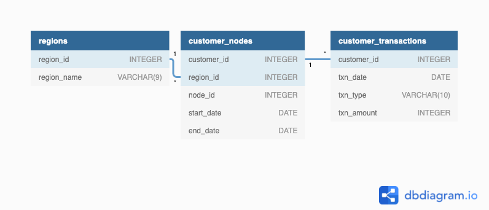

# SQL CHALLENGE WEEK 4 DATABANK

# Table of Contents
- [Introduction](#Introduction)
- [Entity Relationship Diagram](#Entity-Relationship-Diagram)
- [Business Questions and Solutions](https://github.com/Tori-Greg/Danny-Ma-SQL-Challenge_Data-Bank/blob/main/Business%20Questions%20and%20Solutions.md)

## Introduction
There is a new innovation in the financial industry called Neo-Banks: new aged digital only banks without physical branches. 
Danny thought that there should be some sort of intersection between these new age banks, cryptocurrency and the data world…so he decides to launch a new initiative - Data Bank!
Data Bank runs just like any other digital bank - but it isn’t only for banking activities, they also have the world’s most secure distributed data storage platform!

Customers are allocated cloud data storage limits which are directly linked to how much money they have in their accounts. Our objective is to support both the Data Bank team and 
the management team in expanding their overall customer base and accurately estimating their customers' data storage requirements. This will involve computing metrics for 
growth and aiding the business in intelligent data analysis to enhance their forecasting and planning for future developments.

For full challenge kindly click [here](https://8weeksqlchallenge.com/case-study-4/) 

## Entity Relationship Diagram

The Entity-Relationship Diagram (ERD) illustrates the data model for the foodie fi dataset, outlining the relationships among the tables within the dataset.

